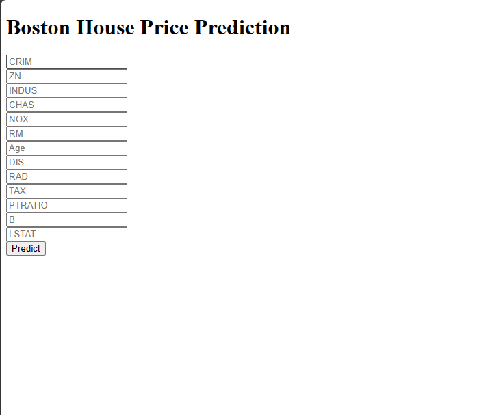

# Boston_House_Price_Prediction
### Software and Tools Requirement
1. [Github Account]()
2. [HerokuAccount]()
2. [VSCodeIDE]()

Create a new Environment

```
conda create -p venv python==3.7 -y
```
### Step1: Create the GUI of the app

### Step2: Create a DockerFile
```
FROM python:3.7
COPY . /app 
WORKDIR /app
RUN pip install -r requirements.txt
EXPOSE $PORT 
CMD gunicorn --workders=4 --bind 0.0.0.0:$PORT app:app

```
### Step3: Git actions
- Create a .github folder
  - Again create a workflows folder in .github folder
      - Write the main.yaml file in it
### Step4: Add files to github repository and commit and push